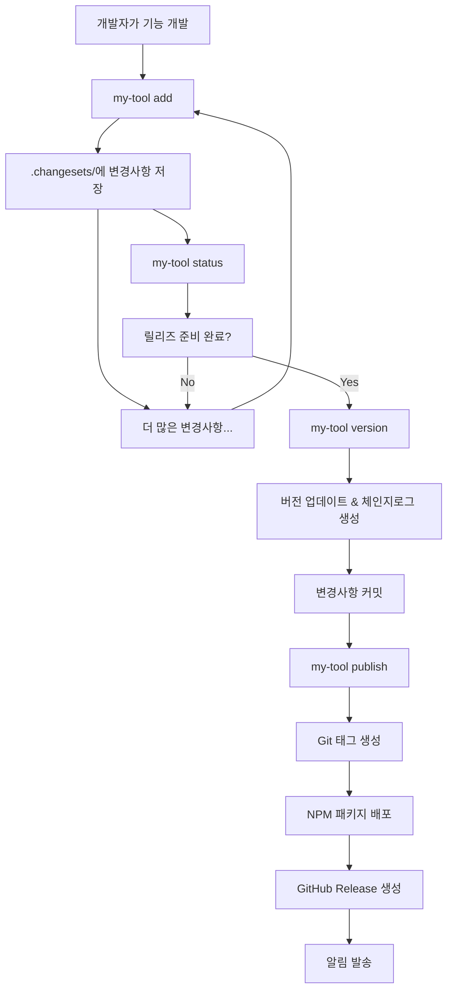

# My-Tool 워크플로우 완전 가이드

## 🎯 전체 워크플로우 개요



## 📋 명령어별 상세 워크플로우

### 1. `my-tool add` - 변경사항 추가

#### 사용자 액션:

```bash
# 대화형으로 실행
my-tool add

# 또는 옵션과 함께
my-tool add --type=patch --message="로그인 버튼 버그 수정"
```

#### 내부 처리 과정:

1. **`.changesets/` 디렉토리 확인/생성**
2. **사용자 입력 수집**:
    - 변경 타입 선택 (major/minor/patch)
    - 변경사항 설명 입력
    - (Monorepo인 경우) 영향받는 패키지 선택
3. **고유 ID 생성** (`happy-cats-dance` 형식)
4. **JSON 파일 생성**: `.changesets/{id}.json`
5. **성공 메시지 출력**

#### 생성되는 파일:

```json
// .changesets/happy-cats-dance.json
{
    "id": "happy-cats-dance",
    "type": "patch",
    "summary": "로그인 버튼 버그 수정",
    "createdAt": "2025-01-15T10:30:00.000Z"
}
```

---

### 2. `my-tool status` - 현재 상태 확인

#### 사용자 액션:

```bash
# 텍스트 출력
my-tool status

# JSON 출력 (CI용)
my-tool status --output=json
```

#### 내부 처리 과정:

1. **현재 버전 읽기** (`package.json`에서)
2. **최신 Git 태그 확인**
3. **미처리 Changeset 목록 수집**
4. **다음 버전 계산**
5. **배포 필요 여부 판단**
6. **상태 정보 출력**

#### 출력 예시:

```
📊 프로젝트 상태

현재 버전: 1.0.2
최신 태그: v1.0.2
미처리 changesets: 3개

📝 대기 중인 변경사항:
  • patch: 로그인 버튼 버그 수정 (happy-cats-dance)
  • minor: 다크모드 테마 추가 (clever-dogs-run)
  • patch: 모바일 레이아웃 개선 (swift-birds-fly)

🚀 예상 다음 버전: 1.1.0
✅ 릴리즈 필요: 예
```

---

### 3. `my-tool version` - 버전 업데이트

#### 사용자 액션:

```bash
# 대화형 실행
my-tool version

# 미리보기만
my-tool version --dry-run
```

#### 내부 처리 과정:

1. **사전 검증**:
    - Git working directory가 clean한지 확인
    - 미처리 changeset이 있는지 확인
2. **버전 계산**:
    - 모든 changeset의 타입 분석
    - Semantic versioning 규칙 적용
    - 다음 버전 결정
3. **사용자 확인**:
    - 변경사항 요약 표시
    - 새 버전 미리보기
    - 계속 진행할지 확인
4. **파일 업데이트**:
    - `package.json` 버전 수정
    - `CHANGELOG.md` 업데이트 (새 섹션 추가)
5. **Changeset 정리**:
    - 처리된 changeset 파일들 삭제
    - (옵션) `.changesets/_archive/v{version}/`로 이동
6. **Git 커밋 생성**:
    - 변경된 파일들 스테이징
    - `chore: release v{version}` 커밋 생성

#### 업데이트되는 파일들:

```json
// package.json
{
    "version": "1.1.0" // 1.0.2에서 업데이트
}
```

```markdown
<!-- CHANGELOG.md -->

# Changelog

## v1.1.0 (2025-01-15)

### 🚀 Features

- 다크모드 테마 추가

### 🐛 Bug Fixes

- 로그인 버튼 버그 수정
- 모바일 레이아웃 개선

## v1.0.2 (2025-01-10)

...
```

---

### 4. `my-tool publish` - 배포 실행

#### 사용자 액션:

```bash
# 대화형 실행
my-tool publish

# CI 환경에서
my-tool publish --ci --skip-confirm

# 시뮬레이션
my-tool publish --dry-run
```

#### 내부 처리 과정:

1. **사전 검증**:
    - Git working directory clean 확인
    - npm registry 권한 확인
    - 현재 브랜치가 main/master인지 확인
    - 배포할 변경사항이 있는지 확인
2. **빌드 & 테스트**:
    - `npm run build` 실행
    - `npm test` 실행 (설정되어 있다면)
3. **릴리즈 정보 확인**:
    - 현재 버전과 최신 태그 비교
    - 체인지로그 내용 표시
    - 사용자 최종 확인 (CI 모드가 아닌 경우)
4. **Git 작업**:
    - `v{version}` 태그 생성
    - 태그와 커밋을 원격으로 푸시
5. **패키지 배포**:
    - `npm publish` 실행
    - (Monorepo인 경우) 각 패키지 순서대로 배포
6. **GitHub Release 생성**:
    - GitHub API를 통해 Release 생성
    - 체인지로그를 Release body로 사용
7. **Docker 이미지 배포** (설정된 경우):
    - Docker 이미지 빌드
    - 컨테이너 레지스트리에 푸시
8. **알림 발송**:
    - Slack/Discord 웹훅 알림
    - 릴리즈 정보와 링크 포함
9. **성공 메시지 출력**

#### 실행 예시:

```
🔍 배포 준비 상태 검증...
✅ Git working directory가 clean합니다
✅ npm 레지스트리 권한 확인 완료
✅ 테스트 통과

📦 릴리즈 준비 완료
현재 버전: v1.0.2 → v1.1.0

📝 변경사항:
### 🚀 Features
- 다크모드 테마 추가

### 🐛 Bug Fixes
- 로그인 버튼 버그 수정
- 모바일 레이아웃 개선

계속하시겠습니까? (Y/n) y

🏷️  Git 태그 생성: v1.1.0
⬆️  원격 저장소에 푸시 중...
📦 NPM 패키지 배포 중...
🎉 GitHub Release 생성 중...
💬 Slack 알림 발송 중...

✅ 릴리즈 완료!
🏷️  태그: v1.1.0
📦 NPM: https://www.npmjs.com/package/your-package
🔗 GitHub: https://github.com/user/repo/releases/tag/v1.1.0
```

---

## 🔧 CI/CD 환경에서의 워크플로우

### GitHub Actions 통합

```yaml
# .github/workflows/release.yml
name: Release

on:
    push:
        branches: [main]

jobs:
    check:
        runs-on: ubuntu-latest
        outputs:
            needs_release: ${{ steps.check.outputs.needs_release }}
        steps:
            - uses: actions/checkout@v4
              with:
                  fetch-depth: 0

            - name: Setup Node.js
              uses: actions/setup-node@v4
              with:
                  node-version: '18'

            - name: Install dependencies
              run: npm ci

            - name: Check release status
              id: check
              run: |
                  STATUS=$(npx my-tool status --output=json)
                  NEEDS_RELEASE=$(echo $STATUS | jq -r '.needsPublish')
                  echo "needs_release=$NEEDS_RELEASE" >> $GITHUB_OUTPUT

    release:
        needs: check
        if: needs.check.outputs.needs_release == 'true'
        runs-on: ubuntu-latest
        steps:
            - name: Publish
              run: npx my-tool publish --ci --skip-confirm
              env:
                  NPM_TOKEN: ${{ secrets.NPM_TOKEN }}
                  GITHUB_TOKEN: ${{ secrets.GITHUB_TOKEN }}
```

### CI 환경에서의 특별한 동작:

- **자동 확인 스킵**: `--ci` 모드에서는 사용자 확인 없이 진행
- **에러 처리 완화**: 배포할 내용이 없어도 성공으로 처리
- **JSON 출력**: 스크립트에서 파싱하기 쉬운 형태로 출력
- **환경변수 활용**: 토큰과 설정을 환경변수에서 읽기

---

## 📁 프로젝트 구조 변화

### 개발 중 (여러 changeset이 쌓인 상태):

```
my-project/
├── .changesets/
│   ├── config.json
│   ├── happy-cats-dance.json    # patch: 로그인 버그 수정
│   ├── clever-dogs-run.json     # minor: 다크모드 추가
│   └── swift-birds-fly.json     # patch: 모바일 개선
├── package.json                 # version: "1.0.2"
├── CHANGELOG.md
└── ...
```

### `my-tool version` 실행 후:

```
my-project/
├── .changesets/
│   └── config.json              # changeset 파일들 삭제됨
├── package.json                 # version: "1.1.0" 업데이트됨
├── CHANGELOG.md                 # 새 섹션 추가됨
└── ...
```

### `my-tool publish` 실행 후:

- Git에 `v1.1.0` 태그 생성
- NPM에 새 버전 배포
- GitHub Release 생성
- 알림 발송

---

## ⚠️ 에러 처리 및 롤백

### 일반적인 에러 상황들:

1. **배포할 변경사항 없음**: 성공으로 처리 (CI 환경)
2. **Git working directory 더러움**: 에러, 정리 후 재시도 요청
3. **테스트 실패**: 에러, 테스트 수정 후 재시도
4. **NPM 배포 실패**: 에러, Git 태그 롤백
5. **네트워크 에러**: 재시도 로직 또는 수동 재시도 안내

### 롤백 전략:

- Git 태그 생성 후 NPM 배포 실패시 → 태그 삭제
- 일부 패키지만 배포된 상태에서 실패시 → unpublish (24시간 내)
- 모든 작업이 완료되면 → 롤백 불가 (새 버전으로 수정사항 배포)
